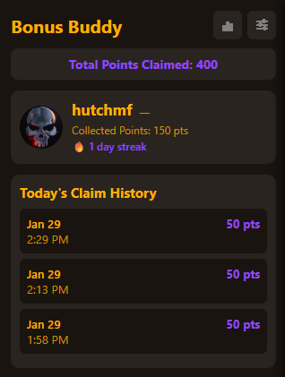
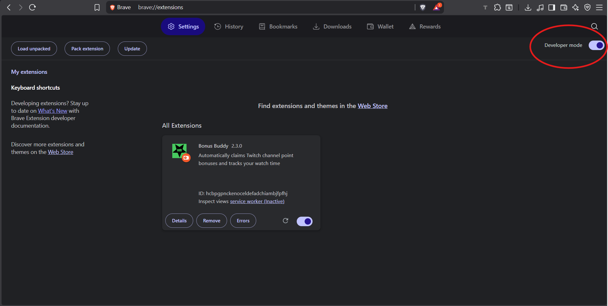
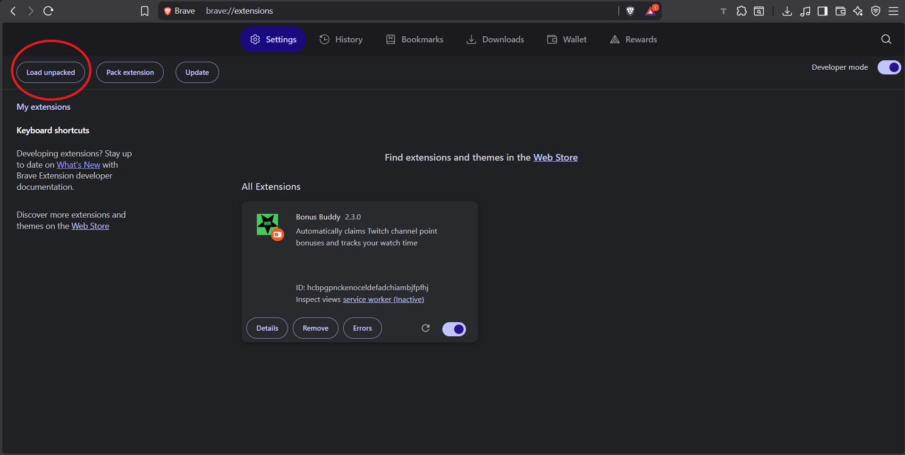
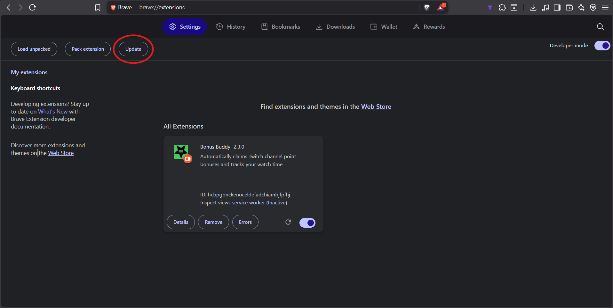
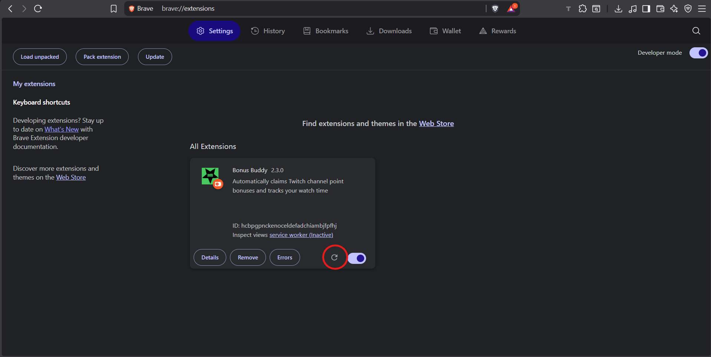

# Bonus Buddy

A Chrome/Brave extension that automatically claims Twitch channel point bonuses across all your open streams.

## Features

- 🎯 **Auto-Claims Bonuses** - Never miss a channel point bonus again
- 📊 **Track Your Stats** - See total points claimed and history per streamer
- 🔥 **Streak Counter** - Track consecutive days watching each streamer
- 🎨 **5 Color Themes** - Choose from Twitch Dark, Earth Tones, Vintage PC, Ocean, and Midnight
- 📈 **Claimed Channels** - View all streamers you've claimed from with total points
- 🔔 **Update Notifications** - Get notified when new versions are available
- 💾 **Data Persistence** - All your stats are saved automatically

## Installation

### First-Time Setup

1. Download the latest release `bonus-buddy-v1.0.0.zip`
2. Extract the zip file to a permanent location (recommended: `Documents/bonus-buddy/`)
3. Open Brave/Chrome and go to `brave://extensions/` (or `chrome://extensions/`)
4. Enable **Developer mode** (toggle in top-right corner)

5. Click **Load unpacked**

6. Select the extracted `bonus-buddy` folder
7. Done! The extension is now active

**⚠️ Important:** After installation, close all open Twitch tabs and open new ones for the extension to work.

### Updating to New Versions

1. Download the latest release zip file
2. Go to your saved extension folder (e.g., `Documents/bonus-buddy/`)
3. **Delete all files** in the folder
4. Extract and paste the new files into the folder
5. Go to `brave://extensions/` click the update button

)
6. Click the **Reload** button on Bonus Buddy

 **⚠️ Important:** After updating, close all open Twitch tabs and open new ones for the changes to take effect.
7. Your data (points, streaks, history) will be preserved automatically

## Usage

Once installed, Bonus Buddy works automatically:

- Open any Twitch live stream
- The extension will claim bonuses in the background
- Click the extension icon to view your stats, I recommend you pin the extension
- Access settings by clicking the slider icon

## Settings

- **Color Themes** - Choose your preferred color scheme
- **Compact Mode** - Enable a smaller popup interface (Experimental, sort of broken)
- **Update Notifications** - See when new versions are available

## Privacy

- All data is stored locally on your device
- No data is sent to external servers
- Only communicates with Twitch.tv

## Support

If you encounter any issues or have suggestions, please [open an issue](https://github.com/tannervalentino/Bonus-Buddy/issues).

## License

MIT License - See LICENSE file for details
